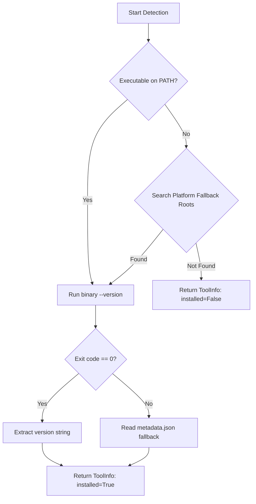
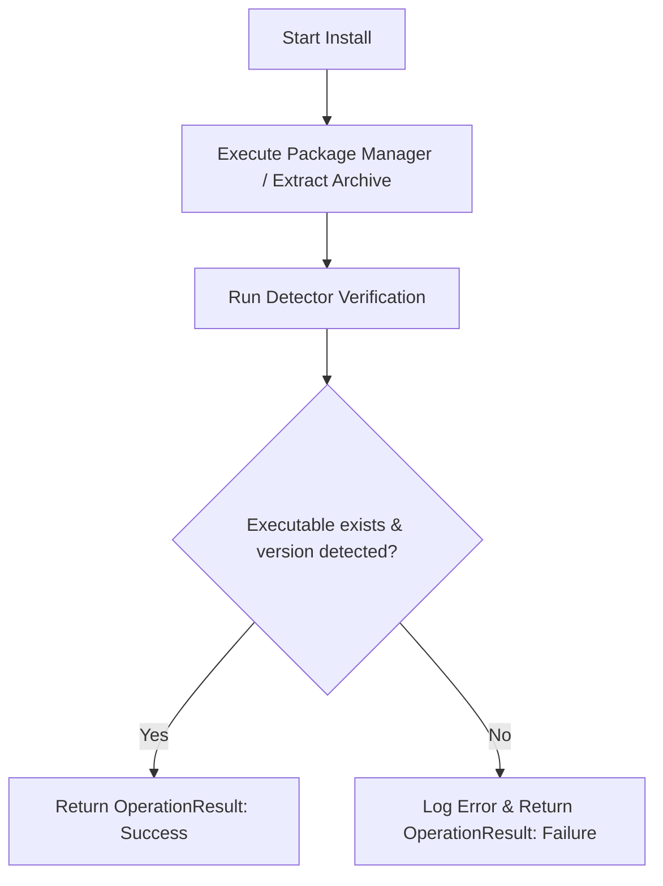
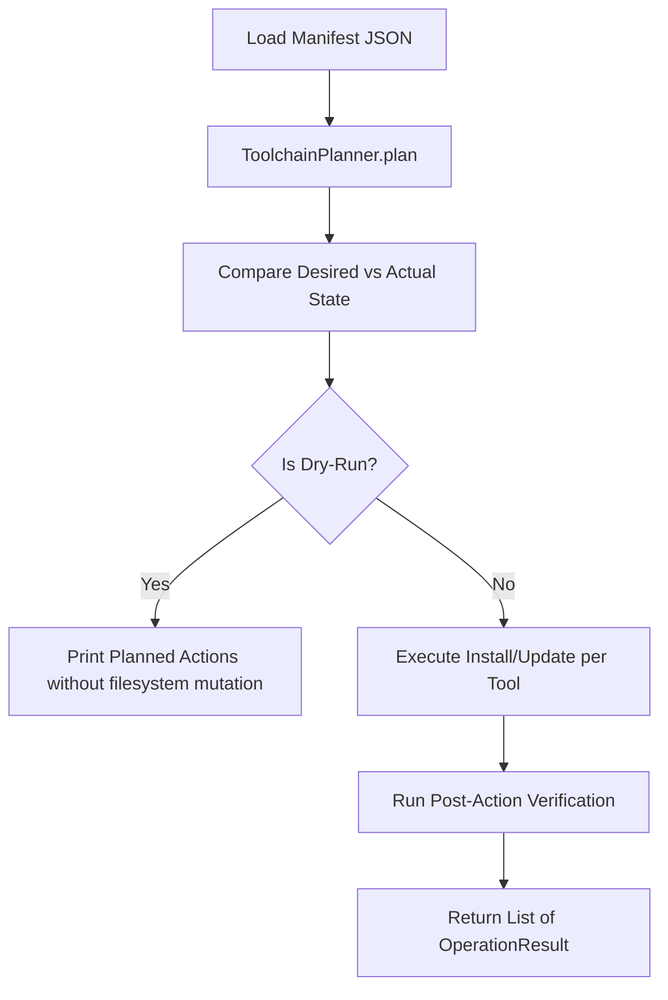

# eSim Tool Manager System Design & Architecture Document

## 1. Introduction

### 1.1 Purpose
This document provides the functional and technical specification for `esim-tool-manager`. It details the architectural decisions, component interfaces, process flows, state management, and platform adapters designed to manage external EDA dependencies required by eSim.

### 1.2 Scope
The eSim Tool Manager unifies four core external tools (**KiCad**, **Ngspice**, **GHDL**, **Verilator**) under a common management abstraction. It encompasses environment detection, automated multi-strategy installation, semantic version updating, health diagnostics, declarative toolchain manifest verification/synchronization, desktop GUI, and CLI interfaces.

### 1.3 Terminology
- **Detector**: A component responsible for querying executable existence and active version on the filesystem.
- **Installer**: A component encapsulating platform-specific package manager or archive extraction logic.
- **Updater**: A component querying upstream package repositories or release feeds to determine available updates.
- **Toolchain Manifest**: A JSON representation (`esim-toolchain.json`) defining desired tool states and versions.
- **OperationResult**: A structured result object returned by manager operations for logging and UI presentation.

---

## 2. Problem & Context

### 2.1 Existing Problem
eSim relies on independent EDA tools across schematic capture (KiCad), SPICE simulation (Ngspice), VHDL processing (GHDL), and Verilog compilation (Verilator). Manually installing these dependencies introduces environment fragility:
- System package managers may register installation state without putting executables on the system `PATH`.
- WinGet package registrations can become stale if binaries are manually deleted.
- Different tools install into divergent locations (per-user `%LOCALAPPDATA%`, system `%ProgramFiles%`, or MSYS2 directories).

### 2.2 Motivation
The eSim Tool Manager introduces a unified management layer that treats the filesystem executable as the authoritative source of truth. It abstracts multi-strategy installations and allows toolchains to be snapshotted, verified, and synchronized deterministically.

### 2.3 Constraints
- Must not require full administrative elevation to launch the manager or GUI.
- Must execute non-interactively without requiring user manual input during background package downloads.
- Must support isolated non-destructive directory updates and automatic rollback for binary archives.

---

## 3. Functional Design

### 3.1 Functional Requirements
- **Dynamic Detection**: Discover tool presence via `shutil.which` and platform fallback search paths.
- **Multi-Strategy Installation**: Support WinGet, MSYS2 `pacman`, local 7z release archives, and `apt`/`dnf`.
- **Health Diagnostics**: Evaluate readiness across the toolchain (`Toolchain Status: READY` vs `INCOMPLETE`).
- **Declarative Synchronization**: Support snapshotting, manifest verification, and `--dry-run` simulation.
- **Dual Interface**: Expose primary workflows through both CLI subcommands and a Tkinter Desktop GUI.

### 3.2 Supported Tools

| Tool | Category | Primary Function | Windows Installation Strategy | Linux Installation Strategy |
|---|---|---|---|---|
| **KiCad** | Core EDA | Schematic & PCB Design | WinGet (`--scope user --force`) | Package manager (`apt`) |
| **Ngspice** | Simulator | SPICE Circuit Simulation | Versioned 7z Release Archive | Binary / Package manager |
| **GHDL** | Simulator | VHDL Simulation & Synthesis | WinGet / MSYS2 | System `apt-get` |
| **Verilator** | Simulator | Verilog HDL Compiler/Simulator | MSYS2 `pacman` / WinGet | System `apt-get` |

### 3.3 Installation
Users can install individual tools (`install <tool>`) or all missing tools sequentially (`install all`). Installation tasks verify the resulting executable on disk before returning success.

### 3.4 Uninstallation
Tools can be cleanly removed individually (`uninstall <tool>`). WinGet-based tools invoke native uninstallers; archive-based tools clean versioned directories in `~/.esim-tools/`.

### 3.5 Version & Update Management
Updaters query upstream feeds (WinGet manifests, MSYS2 pacman database) and compare semantic versions via `packaging.version.Version`. If network queries fail, the manager gracefully reports `Unable to determine latest version` rather than throwing errors.

### 3.6 Configuration
Configuration settings (`install_directory`, `auto_update`) persist in `~/.esim-tools/config.json` and are manageable via CLI (`config --set key value`) or GUI.

### 3.7 Diagnostics
The `doctor` command inspects binary availability, executable paths, system `PATH` inclusion, directory existence, and config validity. The diagnostic system checks the state of the managed toolchain as well as platform prerequisites required by the installers (such as WinGet and MSYS2/pacman on Windows, or standard package managers on Linux). When a prerequisite is unavailable, the diagnostic output reports it and provides an actionable recommendation. Supports `--json` for CI/CD integration.

### 3.8 Toolchain Snapshot, Verification & Sync
- **`snapshot`**: Exports active toolchain state to `esim-toolchain.json`.
- **`verify`**: Compares active detector states against manifest targets (`MATCH` vs `INCOMPLETE`).
- **`sync`**: Plans and executes required `INSTALL` or `UPDATE` actions; supports `--dry-run` to preview actions.

### 3.9 CLI Subcommands
`list`, `check`, `doctor`, `install`, `uninstall`, `update`, `config`, `env`, `snapshot`, `verify`, `sync`, `gui`.

### 3.10 GUI
Tkinter desktop window featuring tool status Treeview, top controls (Refresh, Open eSim), action toolbar (Doctor, Install Selected, Install All, Uninstall Selected, Check Updates, Path Environment, Configuration), and real-time Activity Log.

---

## 4. Process Flows

### 4.1 Tool Detection Flow


### 4.2 Installation & Verification Flow


### 4.3 Toolchain Synchronization Flow


---

## 5. Technical Design

### 5.1 Architecture Diagram
```text
                    eSim Tool Manager
                           |
              +------------+------------+
              |                         |
             CLI                       GUI
              |                         |
              +------------+------------+
                           |
                        Manager
                           |
                        Registry
                           |
             +-------------+-------------+
             |             |             |
          Detector      Installer      Updater
             |             |             |
             +-------------+-------------+
                           |
                    Platform Adapter
                           |
                    Windows / Linux


             Toolchain Manifest
                     |
                   Planner
                     |
              OperationResult
                     |
              Manager / CLI / GUI
```

### 5.2 Component Design
The system uses modular Python classes bound together by `registry.py`:
- `detector.py`: Contains `ToolInfo` dataclass and detector classes (`KiCadDetector`, `NgspiceDetector`, `GhdlDetector`, `VerilatorDetector`).
- `installer.py`: Encapsulates installation logic (`KiCadInstaller`, `NgspiceInstaller`, `GhdlInstaller`, `VerilatorInstaller`).
- `updater.py`: Implements update checking and comparison (`KiCadUpdater`, `NgspiceUpdater`, `GhdlUpdater`, `VerilatorUpdater`).
- `dependency.py`: Implements `DependencyChecker` for environment status, binary validation, and platform prerequisite checking (`WinGet`, `MSYS2 / pacman`).
- `manifest.py`: Implements `OperationResult`, `PlannedAction`, `ToolchainPlanner`, and `ToolchainManager`.
- `platform_adapter.py`: Implements `WindowsAdapter` and `LinuxAdapter`.

### 5.3 Registry (`registry.py`)
Central mapping binding tool keys (`kicad`, `ngspice`, `ghdl`, `verilator`) to their respective Detector, Installer, and Updater classes. `get_detector()`, `get_installer()`, and `get_updater()` factory methods supply instances to CLI and GUI.

### 5.4 Detector (`detector.py`)
Treats actual binary existence as authoritative. Executables are run with `--version` to extract live version strings.

### 5.5 Installer (`installer.py`)
Executes non-interactive subprocess commands. For archived tools (Ngspice), manages versioned directory extraction (`versions/<ver>/`) and symlink/copy activation to `active/`.

### 5.6 Updater (`updater.py`)
Queries package managers or release manifests to resolve latest upstream versions. Performs comparison using `packaging.version.Version`.

### 5.7 Platform Adapter (`platform_adapter.py`)
Decouples operating system specifics: WinGet path resolution and PowerShell PATH formatting on Windows vs `apt`/POSIX shell formatting on Linux.

### 5.8 Planner (`manifest.py`)
`ToolchainPlanner.plan()` accepts manifest inputs and returns `PlannedAction` lists (`NO_ACTION`, `INSTALL`, `UPDATE`, `MISMATCH`, `UNAVAILABLE`) without making system modifications.

### 5.9 OperationResult (`manifest.py`)
Dataclass encapsulating execution details:
```python
@dataclass
class OperationResult:
    tool: str
    action: str
    success: bool
    old_version: str | None = None
    new_version: str | None = None
    message: str = ""
```

### 5.10 Manifest (`esim-toolchain.json`)
JSON document recording schema version and required/detected tool attributes:
```json
{
  "schema_version": 1,
  "tools": {
    "kicad": { "installed": true, "version": "10.0.5", "path": "..." }
  }
}
```

---

## 6. Platform Design

### 6.1 Windows
- **KiCad**: Discovered in `%LOCALAPPDATA%\Programs\KiCad` and `%ProgramFiles%\KiCad`. Installed via `winget install --id KiCad.KiCad --exact --scope user --force`.
- **Ngspice**: Staged in `~/.esim-tools/ngspice/active/`.
- **GHDL**: Installed via WinGet `ghdl.ghdl.ucrt64.mcode`.
- **Verilator**: Discovered via MSYS2 (`C:\msys64\mingw64\bin\verilator_bin.exe`) and updated via `pacman.exe` (`C:\msys64\usr\bin\pacman.exe`).

### 6.2 Linux
Uses `LinuxAdapter` with `apt-get` / `apt` system package managers and standard `/usr/bin` locations.

### 6.3 Package Manager Integration
Processes run non-interactively using `--accept-source-agreements` and `--accept-package-agreements` for WinGet, or `--noconfirm` for pacman.

---

## 7. Error Handling & Recovery

### 7.1 Installation Failures
Before performing an installation that has platform-specific prerequisites, the installer checks whether those prerequisites are available. If a required dependency is missing (e.g. MSYS2/pacman for Verilator on Windows), installation stops with a clear explanation and instructions for resolving the prerequisite. If a package manager returns non-zero or fails to write executables, the installer returns `OperationResult(success=False)` and logs stdout/stderr details.

### 7.2 Permission & UAC
Per-user WinGet scopes (`--scope user`) avoid unnecessary Administrator prompts. If elevated operations are required, targeted PowerShell `Start-Process -Verb RunAs -Wait` calls elevate only the child subprocess.

### 7.3 Version Mismatch
When an installed version does not match the manifest target, `verify` flags `MISMATCH` and `sync` schedules an `UPDATE` action.

### 7.4 Verification Failure
Package manager success codes are ignored if post-install detector checks fail to find `kicad-cli.exe` or equivalent binaries.

### 7.5 Rollback
Archive upgrades (Ngspice) back up `active/` to `active_backup/`. If candidate verification fails, `active_backup/` is automatically restored.

---

## 8. Security & Safety

### 8.1 Privilege Elevation
The GUI and CLI run as standard user processes. Administrative elevation is limited to child subprocesses requiring write access to protected directories.

### 8.2 External Commands
Subprocess arguments are passed as explicit lists (e.g. `[winget, "install", ...]`) rather than shell string commands, preventing shell injection vulnerabilities.

### 8.3 Destructive Operations
Destructive actions like `Uninstall All` have been removed in favor of `Install All`. Individual uninstalls require explicit user confirmation in the GUI.

### 8.4 Dry-Run
`--dry-run` executes `ToolchainPlanner.plan()` and returns expected `OperationResult` entries without invoking installers, updaters, or disk writes.

---

## 9. Design Decisions & Trade-offs

| Decision | Trade-off Made | Rationale |
|---|---|---|
| **Detector-Based Verification** | Extra execution overhead during status checks | Package manager registry state can be stale; checking the executable guarantees operational readiness |
| **No Dynamic Plugin Loading** | Central registry static imports rather than dynamic loading | Keeps code explicit, easy to debug, and eliminates security risks associated with arbitrary code execution |
| **CLI-First Manifest Tools** | Manifest functionality implemented in CLI rather than complex GUI panels | Keeps GUI focused on interactive local management while providing CI/CD scriptability in CLI |

---

## 10. Testing & Validation

Automated testing is performed using `pytest`. The test suite covers detector path resolution, multi-strategy installers, registry wiring, GUI wiring, version comparison, manifest planning, dry-run safety, and safe upgrade/rollback logic.

- **Verified Test Count**: **55 passed** (`pytest` in 1.32s).
- **Test Isolation**: External package managers and filesystem paths are mocked via `monkeypatch` to ensure tests run reproducibly on any environment.

---

## 11. Future Considerations
- Support for macOS homebrew package adapters.
- Custom toolchain profile creation (e.g., analog simulation profile vs digital synthesis profile).
- Environment shell auto-injection hooks for shell startup scripts (`.bashrc` / `$PROFILE`).
